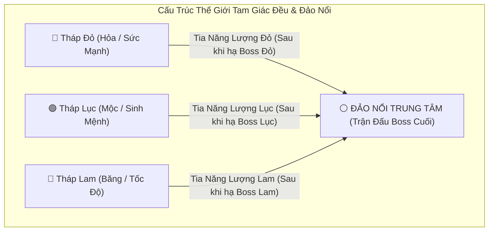
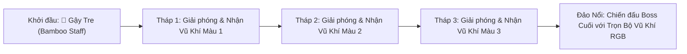

# Thiết Kế Cốt Truyện & Thế Giới: Huyền Thoại Bút Thần Tam Sắc (The RGB Chronicle)

- **Mã tài liệu**: `LORE-RGB-001`
- **Dự án**: 3D Action Roguelite / Hack & Slash
- **Tác giả**: Game Designer & Game Writer (Axit Framework)
- **Trạng thái**: Approved Lore + Prototype Visual Pass
- **Ngày cập nhật**: 2026-08-25
- **Cảm hứng Tiến trình**: *Black Myth: Wukong* (Dọc đường dọn quái nhỏ $\to$ Mini-boss $\to$ Trùm Tháp) kết hợp Thế giới Sáng tạo Bút Thần & Người Que (Stickman).

---

> **Trạng thái triển khai:** Prototype hiện đã thể hiện được hành tinh giấy, đại sảnh có Bút Thần/RGB, ba tuyến cầu/tháp và đảo nổi trung tâm. Tiến trình giải phóng từng tháp, hội tụ ba tia sáng, nhận đủ vũ khí RGB và boss cuối vẫn là nội dung thiết kế, chưa phải toàn bộ gameplay đã hoàn chỉnh.

## 1. Khởi Nguyên Thế Giới: Ngòi Bút Thần & Hành Tinh Giấy (The Canvas Planet)

1. **Sự Khởi Tạo Vạn Vật**:
   - Thuở sơ khai, một **Ngọn Bút Thần Đa Sắc (The Divine Multi-Color Pen)** giáng lâm xuống một hành tinh trắng tinh khôi.
   - Bằng nét vẽ ma thuật, ngọn bút phác họa nên toàn bộ sinh quyển: đồi núi, rừng cây, sông ngòi, các tòa thành và những cư dân dạng **Người Que (Stickman)** tràn đầy sức sống.
2. **Sự Phân Tách Tam Sắc RGB & Tâm Điểm Trắng Sáng (The Tri-Color Harmony & White Isle)**:
   - Năng lượng của Bút Thần được phân tách thành 3 Lõi Nguyên Tố đặt tại **3 Tòa Tháp** nằm ở 3 đỉnh của một **Tam Giác Đều Khổng Lồ**:
     - 🔴 **Tháp Đỏ (Red Ruby Tower — Hỏa Sắc / Nhiệt Huyết)**
     - 🟢 **Tháp Lục (Green Emerald Tower — Mộc Sắc / Sinh Khí)**
     - 🔵 **Tháp Lam (Blue Sapphire Tower — Thủy & Phong Sắc / Tốc Độ & Băng Thanh)**
   - Tại chính giữa tâm tam giác là **Đảo Nổi Trung Tâm (The Central Floating Isle — Màu Trắng / Bạch Kim)**, nơi đặt Quảng Trường Hành Chính & Đền Thờ Bút Thần — biểu tượng cho sự giao thoa hoàn hảo của 3 dải màu RGB ($R + G + B = \text{White Light}$).

---

## 2. Đại Biến Cố: Sự Xâm Lăng Của Bóng Tối Đơn Sắc (The Monochromatic Void)

1. **Kẻ Nuốt Chửng Sắc Màu (The Void Invader)**:
   - Một thực thể tà ác từ vùng hư không đen tối xuất hiện, hút cạn toàn bộ sắc màu, biến hành tinh thành vùng đất chết xám xịt.
2. **Phong Ấn 3 Tháp & Ngắt Nguồn Năng Lượng**:
   - Thực thể Bóng Tối phong ấn cả 3 Lõi RGB vào 3 Tháp, cắt đứt hoàn toàn luồng năng lượng truyền về Đảo Nổi Trung Tâm, khiến Đảo Nổi bị cô lập và rơi vào giấc ngủ đen tối.
   - Ba Thủ Lĩnh Bóng Tối (Tower Bosses) trực tiếp chiếm giữ 3 đỉnh tháp, tha hóa cư dân Stickman thành bầy quái vật cản đường.

---

## 3. Bản Đồ Tổng Thể & Cơ Chế Truyền Năng Lượng Tam Giác (Tri-Tower Energy Grid)

- **Cơ Chế Truyền Năng Lượng (Energy Beam Convergence)**:
  - Khi người chơi giải cứu thành công 1 Tháp $\to$ Đỉnh tháp đó sẽ bắn ra một **Cột Tia Năng Lượng Ánh Sáng** nối thẳng về Đảo Nổi Trung Tâm.
  - Khi cả 3 Tháp đều được giải phóng ($3/3$), 3 luồng năng lượng Đỏ, Lục, Lam cùng hội tụ tại Đảo Nổi, kích hoạt Cầu Thang Ánh Sáng / Cổng Dịch Chuyển đưa người chơi bước lên Quảng Trường Đảo Nổi để đối đầu Boss Cuối.

---

## 4. Hành Trình Người Chơi & Roster Vũ Khí (Weapon Roster)

Nhân vật chính là một **Chiến Binh Stickman** bắt đầu cuộc hành trình giải cứu với vũ khí thô sơ nhất:

### Chi Tiết 4 Vũ Khí Trong Game:

| Giai Đoạn & Nguồn Gốc | Tên Vũ Khí | Hệ Màu & Nguyên Tố | Đặc Tính Chiến Đấu & Moveset |
| :--- | :--- | :--- | :--- |
| **Khởi Đầu (Default)** | **🎋 Gậy Tre (Bamboo Staff)** | ⚪ *Trung Tính (Vật Lý)* | Tốc độ vừa phải, tầm đánh cân bằng, sát thương nhỏ nhưng linh hoạt, dễ combo quét quái nhỏ dọc đường. |
| **Giải Cứu Tháp Đỏ** | **🪓 Hỏa Đại Kiếm (Flame Greatsword)** | 🔴 *Đỏ (Hỏa Sắc)* | Đòn đánh chậm, sát thương cực lớn, Super Armor khi vung kiếm, đòn dậm nổ tạo sóng xung kích chấn động ($R=3.0\text{m}$). |
| **Giải Cứu Tháp Lục** | **🔮 Liềm Sinh Mệnh (Emerald Scythe)** | 🟢 *Lục (Mộc Sắc)* | Tầm quét 360 độ quanh thân, gom quái diện rộng (Vortex Pull), hút máu (+1 Tim) và gây độc làm chậm kẻ địch. |
| **Giải Cứu Tháp Lam** | **🗡️ Song Băng Đoản Kiếm (Frost Daggers)** | 🔵 *Lam (Băng Sắc)* | Tốc độ cực cao, lướt xuyên mục tiêu, tích tầng Frost làm đông cứng và kích nổ sát thương chí mạng. |

---

## 5. Cấu Trúc Tuyến Đường Dọc Mỗi Tháp (Black Myth: Wukong Progression)

Mỗi tháp là một tuyến đường leo núi / vượt ải gồm 3 chặng rõ rệt:

1. **Chặng 1 — Dọc Đường (Path of Swarmers)**:
   - Người chơi dùng **Gậy Tre** quét các nhóm quái nhỏ 2-3 con để làm quen di chuyển, luyện tập nhảy né đòn và tích điểm combo Pip 1-2-3 $\to$ Finisher.
2. **Chặng 2 — Chốt Chặn Giữa Đường (Mid-Way Gate & Mini-Boss)**:
   - Đụng độ quái Hộ Vệ to lớn hoặc Cung thủ chiếm cứ điểm cao. Người chơi áp dụng **Jump System ($H=1.5\text{m}$)** vượt bậc đá để triệt hạ.
3. **Chặng 3 — Đỉnh Tháp (Tower Summit Boss Arena)**:
   - Sàn đấu Đỉnh Tháp đối đầu Boss Canh Giữ Lõi.
   - Tiêu diệt Boss $\to$ Kích hoạt hiệu ứng **Color Bloom** (phục hồi màu sắc toàn vùng) $\to$ Nhận Vũ khí Nguyên tố mới $\to$ Tháp bắn tia năng lượng về Đảo Nổi Trung Tâm.

---

## 6. Hồi Kết: Trận Chiến Tại Quảng Trường Đảo Nổi (The Floating Sky Citadel)

- **Địa điểm**: Quảng Trường Lớn trên Đảo Nổi Trung Tâm — nơi giao thoa của 3 luồng năng lượng RGB.
- **Boss Cuối Cùng**: **Thực Thể Hư Không Tối Thượng (Void Sovereign)**.
- **Gameplay Đỉnh Cao**:
  - Người chơi tự do hoán đổi linh hoạt giữa Gậy Tre và 3 Vũ Khí RGB bằng phím `Q`/`Tab` (*Switch Strike*).
  - Boss Cuối sẽ luân chuyển các trạng thái lá chắn màu sắc, buộc người chơi phải liên tục đổi vũ khí tương ứng để phá giáp.
- **Chiến Thắng Tuyệt Đối**:
  - Tiêu diệt Boss $\to$ Ba viên ngọc RGB hội tụ vào Đảo Nổi, tái sinh **Ngọn Bút Thần Đa Sắc**.
  - Toàn bộ hành tinh bừng sáng trong biển sắc màu rực rỡ, toàn thể cư dân Stickman ăn mừng chiến thắng!
